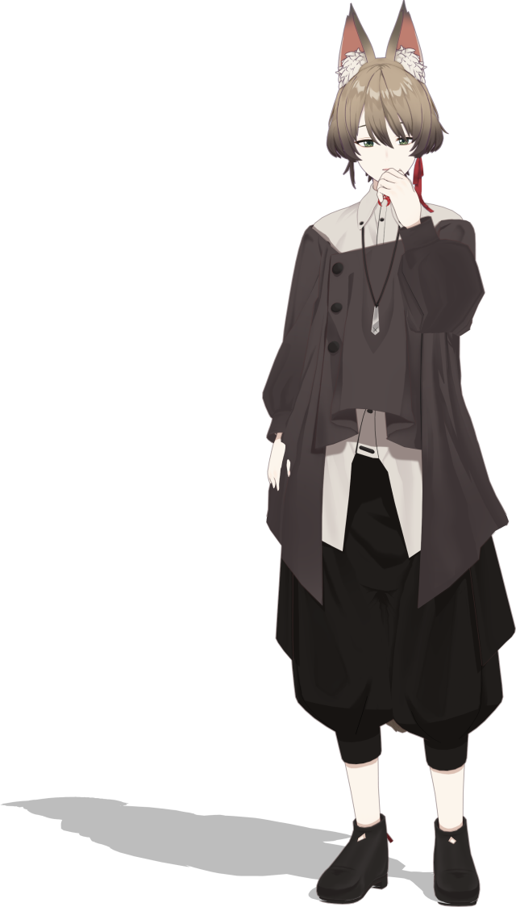

# CG アバター 「うか」

[](README.md)
[](README.ja.md)



「うか / Uka」は[ムーンショット型研究開発「アバター共生社会」](https://avatar-ss.org/)で開発された CG-CA (Cybernetic Agent) アバターのキャラクターモデルです。
[MMDAgent-EX](https://github.com/mmdagent-ex/MMDAgent-EX) を用いた対話システムのために開発されたモデルです。

ファイルフォーマットは MikuMikuDance 形式であり、MMD のツールで利用・編集・変更が行えます。

## 主要なファイル

このレポジトリには MMD 形式のモデル、MMDAgent-EX 用の設定ファイル、およびサンプルの対話用モーションが含まれています。

```text
   MS_Uka.pmd           モデルファイル(.pmd)
   MS_Uka.pmd.csv       モデル拡張定義ファイル
   MS_Uka.pmd.shapemap  リップシンク用定義ファイル for MMDAgent-EX
   MS_Uka.pmx           モデルファイル(.pmx)
   tex/                 モデル用テクスチャファイル
   motion/              対話リアクションサンプルモーション
```

## モデルスペック

- 49951 頂点, 77907 面, 10材質, 8 テクスチャ
- A ポーズ、MMD互換スケール
- 301 ボーン（MMD準標準ボーン対応）
- 148 モーフ（MMD互換+パーフェクトシンク）
- 物理演算：164剛体, 151ジョイント

## 利用方法

MMDAgent-EX で `Uka.pmd` を `MODEL_ADD` 等で指定して使ってください。

MMD のツール等でで読み込む場合は `Uka.pmx` のほうを使ってください。

## ライセンス

本レポジトリに含まれるファイルは全て [CC-BY 4.0 ライセンス](https://creativecommons.org/licenses/by/4.0/deed.ja)で公開されています。利用の際は以下のクレジット表記を用いてください。

```text
CG-CA Uka (c) 2023 by Nagoya Institute of Technology, Moonshot R&D Goal 1 Avatar Symbiotic Society
```

## 利用ガイドライン

本レポジトリに含まれるファイルの利用および二次創作に対するガイドラインを以下のとおり定めます。なお、本ガイドラインは時代や技術の進展、法的要件の変更に応じて更新されることがあります。

してはいけない使い方：

- 児童性的虐待となる素材、または児童を搾取したり傷つけたりするコンテンツの再生
- 憎悪（ヘイト）、ハラスメント、暴⼒を助長するコンテンツの作成
- 物理的な危害を及ぼす危険性の⾼い活動。以下を含む：
  - 武器の製造
  - 軍事・紛争
  - エネルギー・交通・水等の重要施設の管理やオペレーション
  - 自殺・傷つけ・摂食障害などの自傷行為を促進、奨励、または描写するコンテンツ
- 詐欺的あるいは欺瞞的な⾏為。以下を含む：
  - 詐欺
  - 組織的な不正行為
  - 盗作
  - 偽情報の拡散
  - 他者を欺く目的で、実在の人物、団体、組織になりすましたり、虚偽の表現をする行為
- MikuMikuDance (MMD) の関連コミュニティおよびそこにある有形無形の価値を害する行為。以下を含む：
  - モデル・モーション・音楽等の権利者の権利を損なう行為
  - 権利者が定めるガイドラインに従わない利用
  - 不当な二次配布・盗用・作者なりすまし

なお、二次創作を原因とする利用者間のトラブルについて、公式は一切責任を負いません。自己責任でお願いします。

<p xmlns:cc="http://creativecommons.org/ns#" xmlns:dct="http://purl.org/dc/terms/"><a property="dct:title" rel="cc:attributionURL" href="https://github.com/mmdagent-ex/uka">CG-CA Uka</a> by <span property="cc:attributionName">Nagoya Institute of Technology</span> is licensed under <a href="http://creativecommons.org/licenses/by/4.0/?ref=chooser-v1" target="_blank" rel="license noopener noreferrer" style="display:inline-block;">CC BY 4.0</a></p>
